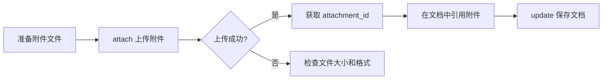

# 附件上传指南

**快捷命令：**
```bash
# 上传图片附件到文档
iwiki-cli attach 4018955627 --file ./screenshot.png

# 上传 PDF 附件到文档
iwiki-cli attach 4018955627 --file ./report.pdf
```

## 工作流程



## 使用流程

### 步骤 1：上传附件
```bash
iwiki-cli attach 4018955627 --file ./screenshot.png

# 输出:
# ✅ 附件上传成功!
#    文件名:     screenshot.png
#    附件 ID:    11426698
#    引用方式:   
```

### 步骤 2：在文档中引用附件
上传成功后，使用返回的 `attachment_id` 构造引用链接：
```
/tencent/api/attachments/s3/url?attachmentid=<attachment_id>
```

### 步骤 3：保存文档
必须使用 `update` 命令将引用写入文档内容：
```bash
iwiki-cli update 4018955627 --title "我的文档" --body "这是文档内容。

"
```

或从文件读取更新内容：
```bash
iwiki-cli update 4018955627 --title "我的文档" --file ./content.md
```

## 参数说明

| 参数 | 缩写 | 必填 | 说明 |
|------|------|------|------|
| `<doc_id>` | | **是** | 目标文档 ID（位置参数） |
| `--file` | `-f` | **是** | 本地文件路径（图片、PDF 等） |

## 限制和注意事项

1. **文件大小限制：** 最大支持 **50MB**
2. **支持的文件类型：** 图片（png/jpg/gif/svg/webp）、PDF、Office 文档等
3. **必须先有文档：** 附件需要绑定到已存在的文档，需先创建文档获取 doc_id
4. **上传后必须保存：** 上传附件后需要调用 `iwiki-cli update` 将引用写入文档内容，否则附件不会在文档中显示
5. **Markdown 引用格式：** ``

## 错误处理

| 错误 | 原因 | 解决方案 |
|------|------|----------|
| 文件不存在 | 路径错误 | 检查文件路径是否正确 |
| 文件过大 | 超过 50MB | 压缩文件或拆分上传 |
| 获取预签名 URL 失败 | 权限不足或文档不存在 | 确认 doc_id 正确且有写入权限 |
| 上传到 COS 失败 | 网络问题 | 重试上传 |
