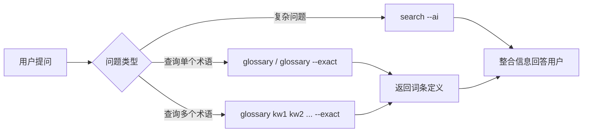

# 场景：使用词条 AI 搜索并补充上下文


**快捷命令：**
```bash
# 模糊搜索词条
iwiki-cli glossary "微服务" --limit 10

# 精确搜索词条
iwiki-cli glossary "CI/CD" --exact

# 批量精确搜索
iwiki-cli glossary "Docker" "Kubernetes" "CI/CD" --exact

# 限定词库范围
iwiki-cli glossary "微服务" --glossary-ids "123,456"

# 以 JSON 格式输出
iwiki-cli glossary "微服务" --json

# 结合 AI 搜索
iwiki-cli search "如何设计微服务架构？" --ai --limit 3
```
## 工作流程



## 核心工具
### 1. 词条搜索工具
#### glossary - 模糊搜索词条
**何时使用：**
- 用户询问"XXX 是什么意思"，xxx怎么配置/使用
- 需要搜索包含关键词的所有词条
- 不确定词条的准确名称
**用法：**
```bash
iwiki-cli glossary "微服务"
iwiki-cli glossary "微服务" --limit 10
```
**参数：**
| 参数 | 缩写 | 默认值 | 说明 |
|------|------|--------|------|
| `--exact` | `-e` | false | 精确搜索模式（支持批量查询多关键词） |
| `--limit` | `-l` | 10 | 模糊搜索返回数量（仅模糊搜索生效） |
| `--glossary-ids` | `-g` | "" | 限定词库 ID 列表，逗号分隔 |
| `--aliases` | `-a` | true | 精确搜索时是否包含别名匹配 |
| `--json` | | false | 以 JSON 格式输出结果 |


#### glossary --exact - 精确搜索词条（忽略大小写）
**何时使用：**
- 用户提供了准确的术语名称
- 需要精确匹配（忽略大小写）
- 避免模糊匹配带来的噪音
**用法：**
```bash
iwiki-cli glossary "RESTful API" --exact
```

#### glossary --exact（批量）- 批量精确搜索词条
**何时使用：**
- 需要同时查询多个术语
- 文档中包含多个专业名词需要解释
- 批量获取定义，减少请求次数
**用法：**
```bash
iwiki-cli glossary "Docker" "Kubernetes" "CI/CD" "DevOps" --exact
```

### 2. AI 语义搜索和上下文补充
#### search --ai - AI 语义搜索
**何时使用：**
- 用户提出复杂问题或句子
- 传统关键词搜索无结果
- 需要理解用户意图并找到相关文档
**用法：**
```bash
iwiki-cli search "如何在生产环境中部署微服务并保证高可用？" --ai --limit 5
```

#### get - 获取文档补充上下文
**何时使用：**
- AI 搜索找到相关文档后
- 需要获取文档的详细内容
- 补充上下文信息回答用户问题
**用法：**
```bash
iwiki-cli get 123456
```

**工作流程：**
1. 使用 `iwiki-cli search --ai` 找到相关文档
2. 对每个文档调用 `iwiki-cli get <docid>` 获取详细内容
3. 提取关键信息并整合
4. 基于文档内容回答用户问题

## 实践示例
### 示例 1：解释单个术语
**用户需求：** "什么是 CI/CD？"
**执行步骤：**
1. **识别关键术语**
```
提取：CI/CD
```
2. **精确搜索词条**
```bash
iwiki-cli glossary "CI/CD" --exact
```
3. **返回定义**
```
根据词条定义向用户解释 CI/CD 的含义
```

### 示例 2：批量解释多个术语
**用户需求：** "解释一下 Docker、Kubernetes 和 Service Mesh"
**执行步骤：**
1. **提取术语列表**
```
提取：Docker, Kubernetes, Service Mesh
```
2. **批量精确搜索**
```bash
iwiki-cli glossary "Docker" "Kubernetes" "Service Mesh" --exact
```
3. **整理并返回**

### 示例 3：结合搜索和词条的综合解答
**用户需求：** "公司的 DevOps 流程是怎样的？"
**执行步骤：**
1. **AI 搜索相关文档**
```bash
iwiki-cli search "公司的 DevOps 流程" --ai --limit 5
```
2. **批量获取术语定义**
```bash
iwiki-cli glossary "CI/CD" "容器化" "自动化测试" --exact
```
3. **综合回答**
```
结合：
- 文档中的流程说明
- DevOps 的定义
- 相关术语的解释

向用户提供完整、准确的答案
```