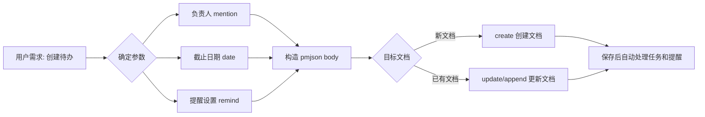

# 场景：创建待办任务列表（TaskList）

**快捷命令：**
```bash
# 创建包含待办任务的文档（从文件读取 body JSON）
iwiki-cli create --parent 67890 --title "任务列表" --type DOC --file ./content.json

# 在现有文档末尾追加待办任务
iwiki-cli append 123456 --after-file ./tasklist.json
```

## 工作流程



## PMJSON Body 格式

iWiki 使用 ProseMirror JSON（pmjson）格式存储富文本文档内容。待办任务列表对应的节点层级关系为：

```
doc
 └── taskList（任务列表容器）
      └── taskItem（单个任务项）
           ├── mention（负责人 @提及）
           ├── text（任务描述文本）
           └── date（截止日期 + 提醒设置）
```

### 节点属性速查表

| 节点 | 属性 | 类型 | 说明 |
|------|------|------|------|
| `taskList` | `localId` | string | UUID，任务列表唯一标识 |
| `taskItem` | `localId` | string | UUID，任务项唯一标识 |
| | `state` | string | 任务状态：`"TODO"` 或 `"DONE"` |
| | `update_time` | string | 最后更新时间，格式 `"YYYY-MM-DD HH:mm:ss"` |
| `mention` | `id` | string | **用户名**（英文 ID，如 `"jaxxonli"`） |
| | `text` | string | 显示文本，格式 `"@username(中文名)"` |
| | `mentionid` / `accessLevel` / `userType` | - | 固定值：`"s59mmm6c6"` / `""` / `null`（可省略 mentionid） |
| `date` | `timestamp` | string | **毫秒时间戳**（UTC+8 零点，见下方计算规则） |
| | `localId` | string | UUID，日期节点唯一标识 |
| | `remind` | object | 提醒设置（见下表） |

### remind 对象

| 属性 | 类型 | 说明 | 可选值 |
|------|------|------|--------|
| `remind` | boolean | 是否开启提醒 | `true` / `false` |
| `remind_time` | string | 提醒时刻（当天几点提醒） | 如 `"09:00"`, `"10:00"` |
| `remind_option` | string | 提醒时机 | `"0"`=当天, `"1"`=提前一天, `"2"`=提前两天, `"3"`=提前一周 |
| `repeat` | string | 重复方式 | `"0"`=不重复, `"1"`=每天, `"2"`=每周, `"3"`=每月 |
| `end_repeat` | string | 结束重复时间 | 时间戳或 `""`（无结束时间） |
| `remind_user` | string[] | 需要提醒的用户列表 | 如 `["provihuang", "jaxxonli"]` |

## 时间戳计算规则

iWiki 日期的 `timestamp` 使用 **毫秒级时间戳**，且已加 8 小时偏移：

```
timestamp = (目标日期 UTC+8 零点的 Unix 时间戳) × 1000
```

**示例：** 目标截止日期 `2026-06-03` → UTC+8 零点 = Unix `1780444800` → timestamp = `"1780444800000"`

> ⚠️ 后端存储时会自动减去 8 小时进行还原，因此生成时必须使用带偏移的值。

## 实践示例

### 示例 1：在新文档中创建带负责人和提醒的待办

**用户需求：** "在我的空间下创建一个待办文档，给 jaxxonli 安排一个任务'完成接口联调'，6月5日截止，提前一天10点提醒"

**执行步骤：**

1. **确定用户空间**
```bash
iwiki-cli recent edit --page_size 3
```

2. **生成 UUID 并计算时间戳**
   - `localId` 使用标准 UUID v4 格式
   - 6月5日截止 → timestamp = `"1780617600000"`（2026-06-05 UTC+8 00:00:00）
   - `update_time` 使用当前时间

3. **构造 pmjson 文件** (保存为 `/tmp/tasklist_body.json`)
```json
{
  "type": "doc",
  "content": [
    {
      "type": "taskList",
      "attrs": {
        "localId": "<生成的UUID>"
      },
      "content": [
        {
          "type": "taskItem",
          "attrs": {
            "localId": "<生成的UUID>",
            "state": "TODO",
            "update_time": "2026-06-03 11:55:00"
          },
          "content": [
            {
              "type": "mention",
              "attrs": {
                "id": "jaxxonli",
                "text": "@jaxxonli(李晋)",
                "accessLevel": "",
                "userType": null
              }
            },
            {
              "type": "text",
              "text": " 完成接口联调 "
            },
            {
              "type": "date",
              "attrs": {
                "timestamp": "1780617600000",
                "localId": "<生成的UUID>",
                "remind": {
                  "remind": true,
                  "remind_time": "10:00",
                  "remind_option": "1",
                  "repeat": "0",
                  "end_repeat": "",
                  "remind_user": ["jaxxonli"]
                }
              }
            }
          ]
        }
      ]
    },
    {
      "type": "paragraph"
    }
  ],
  "version": 1
}
```

4. **创建文档**
```bash
iwiki-cli create --parent <parent_id> --title "本周待办任务" --type DOC --file /tmp/tasklist_body.json
```

5. **清理临时文件**
```bash
rm /tmp/tasklist_body.json
```

### 示例 2：在现有文档中追加待办任务

**用户需求：** "在文档 12345 追加一个任务，@provihuang 完成数据迁移，6月10日截止，当天 9 点提醒"

**执行步骤：**

1. **获取现有文档内容**
```bash
iwiki-cli get 12345 --format json
```

2. **在 body 中找到已有 taskList 或创建新的 taskList，追加 taskItem**

3. **更新文档**
```bash
iwiki-cli update 12345 --file /tmp/updated_body.json
```

4. **清理临时文件**
```bash
rm /tmp/updated_body.json
```

### 示例 3：批量创建多个任务（不同负责人和日期）

**用户需求：** "创建任务列表：1) jaxxonli 完成代码评审，6月5日截止；2) provihuang 更新文档，6月10日截止"

在同一个 `taskList` 下放多个 `taskItem` 即可，body 结构参考示例 1，`content` 数组中追加第二个 `taskItem`：

```json
{
  "type": "taskItem",
  "attrs": {
    "localId": "<生成的UUID>",
    "state": "TODO",
    "update_time": "2026-06-03 12:00:00"
  },
  "content": [
    {
      "type": "mention",
      "attrs": {
        "id": "provihuang",
        "text": "@provihuang(黄天意)",
        "accessLevel": "",
        "userType": null
      }
    },
    {
      "type": "text",
      "text": " 更新文档 "
    },
    {
      "type": "date",
      "attrs": {
        "timestamp": "1781049600000",
        "localId": "<生成的UUID>",
        "remind": {
          "remind": true,
          "remind_time": "09:00",
          "remind_option": "0",
          "repeat": "0",
          "end_repeat": "",
          "remind_user": ["provihuang"]
        }
      }
    }
  ]
}
```

## 注意事项

1. **UUID 生成**：所有 `localId` 必须使用标准 UUID v4 格式，可通过 `uuidgen` 或编程生成
2. **文档类型**：包含 taskList 的文档必须是 `DOC` 类型（富文本），不是 `MD` 类型
3. **mention 位置**：`mention` 节点通常放在 `taskItem.content` 的开头或紧跟在任务描述文本之后
4. **提醒生效条件**：`remind.remind` 必须设为 `true` 才能生效，同时需要指定 `remind_user`
5. **结尾段落**：body 的 `content` 数组末尾通常需要加一个 `{"type": "paragraph"}` 空段落节点
6. **保存后自动处理**：文档保存后，后端会自动提取 `taskItem`、`mention`、`date`+`remind` 分别存入对应数据表

---

- [← 返回主 Skill 文档](../SKILL.md)
