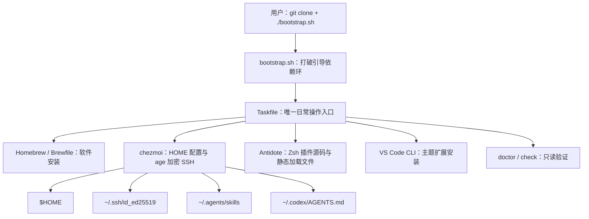

# dotfiles 完全重构计划

**状态：** 设计已确认，待实施

**目标平台：** macOS

**设计日期：** 2026-07-17

## 1. 目标与边界

这次工作不是在旧仓库上继续打补丁，而是重新定义一套个人 macOS 开发环境：能够在新 Mac 上从公开仓库恢复软件、配置与 SSH 身份；平时只通过 Taskfile 操作；结构足够清楚，未来若增加其他系统，也不需要替换核心管理器。

完成后的默认路径必须满足：

1. 用户先通过 HTTPS 将公开仓库 clone 到任意目录。
2. `bootstrap.sh` 从自身位置识别仓库根目录，补齐最小依赖后把控制权交给 `task bootstrap`。
3. Homebrew 安装最小软件白名单。
4. chezmoi 从当前仓库的 `home/` source state 部署配置。
5. age 解密并复用同一把 SSH 私钥。
6. Zsh、Ghostty、VS Code、Codex CLI 与桌面入口达到可用状态。
7. 所有步骤可重复执行；失败后修复原因并重跑，不依赖回滚脚本。

本次明确不做：

- 不实现 Windows 或 Linux；旧的跨平台分支、脚本、文档和测试全部移除。工具选型应具备未来扩展能力，但现在不保留兼容代码。
- 不区分 Mac mini、MacBook、主机名或硬件能力；所有 Mac 使用同一套软件与配置。以后出现真实差异再建模。
- 不管理 Dock、Finder、键盘、触控板、电池等 macOS 系统偏好。
- 不管理项目语言工具链。Go、Rust、Node、项目 Python 等由各项目自行声明。
- 不管理 Git 配置、提交签名、SSH Host 配置或 `known_hosts`。
- 不同步 shell 历史，不使用跨设备历史服务。
- 不配置 VS Code 的 Codex 扩展；Codex 使用桌面入口与 CLI。
- 不管理 Codex 的 `config.toml`、认证、会话、日志、插件、MCP 或缓存。
- 不自动卸载当前机器上的旧软件，也不删除已不受管的旧 HOME 配置；`task doctor` 也不报告这些遗留项。
- 不提供自动卸载、整机清理或伪事务式回滚。

## 2. 证据基础与问题判断

旧仓库已经偏离当前使用方式：它同时面向 macOS、Linux、Windows，以 Nushell、Atuin、mise、WezTerm、Neovim、CodeBuddy 和 OpenCode 为中心；包安装又由模板生成的大型 shell 脚本解释自定义数据模型。[E1]

实际使用状态也存在明显不一致：WezTerm 使用 Maple Mono NF CN，但 macOS 包清单安装的是 Fira Code 与 JetBrains Mono；VS Code settings 引用了未安装的 Vim、WhichKey、Palenight、Material Icon 和 Bongo Cat 扩展；当前 VSCodium 扩展清单与官方 VS Code 状态也不一致。[E2][E3]

根因不是某几个配置过期，而是职责混合：chezmoi 模板同时承担包管理、平台路由、编辑器复用和安装编排。继续维护旧抽象会让已经取消的系统与工具继续决定新设计。目标模型必须重新分配所有权：Taskfile 负责编排，Homebrew 负责可用的软件包，chezmoi 负责 HOME 配置与加密文件，上游工具负责自己的插件或缓存语义。chezmoi 的模板、多机能力、age 全文件加密和跨平台实现直接覆盖目标语义，而 Stow 与 yadm 分别需要补建关键能力或接受更间接的加密模型。[E11]

## 3. 最终架构



职责边界固定如下：

| 层 | 拥有的职责 | 明确不拥有 |
|---|---|---|
| `bootstrap.sh` | 检查 macOS/CLT，安装 Homebrew、Task、chezmoi、Python 3 等最小引导依赖，调用 `task bootstrap` | 业务配置、软件白名单解释、clone 仓库 |
| Taskfile | 公共命令、顺序、失败传播、幂等重跑 | HOME 文件内容、插件缓存算法、通用包管理器实现 |
| Homebrew/Brewfile | 有可靠 formula/cask 的软件安装 | HOME 配置、自动清理未列软件、GUI 应用更新策略 |
| chezmoi | HOME 中的稳定配置、权限、模板、age 加密文件 | 软件安装编排、shell 插件更新策略、机器清理 |
| Python 3 标准库脚本 | 确实需要解析、校验或跨多条系统命令的辅助行为 | 可以直接由上游 CLI 表达的操作、第三方依赖 |
| 系统/上游命令 | `brew`、`defaults`、`plutil`、`ssh-keygen` 等已经直接表达目标语义的操作 | 被无必要的 Python wrapper 再包装 |

不建设“万能安装器”。以后出现 Homebrew 不能覆盖的软件时，优先使用官方 CLI 或安装器；只有确有解析、校验、下载和幂等编排需求时才增加一个聚焦的 Python 3 标准库脚本。Taskfile 为这些未来步骤提供扩展点，但首版不预建抽象。

## 4. 仓库结构

使用 chezmoi 官方 `.chezmoiroot` 原语，将 HOME source state 与仓库编排文件隔离。[E4]

```text
.
├── .chezmoiroot                 # 固定内容：home
├── .gitignore
├── .github/
│   └── workflows/check.yml
├── .local/                      # 仅本机；整个目录 git ignored
│   └── age/identity.txt         # age identity，0600
├── bootstrap.sh                 # POSIX sh
├── Brewfile
├── Taskfile.yml                 # 公共 API 与 includes
├── tasks/
│   ├── brew.yml
│   ├── chezmoi.yml
│   ├── shell.yml
│   ├── terminal.yml
│   ├── vscode.yml
│   ├── doctor.yml
│   └── check.yml
├── scripts/                     # 仅 Python 3 标准库辅助脚本
├── docs/
├── home/                        # 唯一 chezmoi source state
│   ├── .chezmoi.toml.tmpl
│   ├── dot_zshrc
│   ├── dot_zsh_plugins.txt
│   ├── dot_config/
│   │   ├── ghostty/config
│   │   └── starship.toml
│   ├── dot_agents/skills/
│   ├── dot_codex/AGENTS.md
│   ├── dot_ssh/
│   │   ├── encrypted_private_id_ed25519.age
│   │   └── id_ed25519.pub
│   └── Library/Application Support/Code/User/
│       ├── settings.json
│       └── keybindings.json
├── AGENTS.md                    # 仅描述本仓库
├── README.md
└── plan.md
```

具体 chezmoi 加密文件名必须以实际 `chezmoi add --encrypt --age-recipient ...` 生成结果为准；上面的名字表达目标路径和属性，不允许靠手写命名猜测 chezmoi 的转换规则。

仓库根 `AGENTS.md` 与全局 `~/.codex/AGENTS.md` 是两个独立事实源：前者只描述本 dotfiles 仓库的结构、命令和验证规则；后者保留现有的个人跨项目规则。二者不通过模板拼接，避免项目知识泄漏到所有 Codex 工作区。

## 5. 新机引导与日常流程

### 5.1 首次引导

仓库公开，首次获取固定使用 HTTPS。仓库可位于任意目录，脚本不得假设 `~/.local/share/chezmoi`：

```sh
git clone https://github.com/tlipoca9/dotfiles.git <任意目录>
cd <任意目录>
./bootstrap.sh
```

`git clone` 本身需要 Command Line Tools。若 stock macOS 尚未具备 Git，用户先完成系统弹出的 CLT 安装，再重试 clone。`bootstrap.sh` 仍必须检查 `xcode-select -p`，缺失时给出明确操作并停止。

脚本使用 POSIX `sh`，不用 Makefile。它通过可靠的脚本路径解析得到 `REPO_ROOT`，验证该目录包含 `Taskfile.yml`、`.chezmoiroot` 和 `.git`，然后：

1. 只允许在 Darwin 上运行，其他系统明确失败。
2. 检查 Command Line Tools。
3. 使用 Homebrew 官方安装脚本安装缺失的 Homebrew。
4. 用 `brew shellenv` 获取环境，不硬编码 `/opt/homebrew` 或 `/usr/local`，同时兼容 Apple Silicon 与 Intel Mac。
5. 安装运行 Taskfile 所需的最小依赖。
6. 检查 `$REPO_ROOT/.local/age/identity.txt` 是否存在、权限是否为 `0600`、是否被 Git 忽略且未被跟踪。缺失时停止并提示导入，不自动生成一把无法解密现有 SSH 文件的新 identity。
7. 在 `REPO_ROOT` 中运行 `task bootstrap`。

仓库不会 clone 自己，也不会自动 `git pull`。SSH 私钥部署并通过验证后，内部任务将当前仓库的 origin 从 HTTPS 改为 `git@github.com:tlipoca9/dotfiles.git`；这只修改本仓库 remote，不创建或管理全局 Git 配置。

### 5.2 Taskfile 公共 API

`Taskfile.yml` 是 bootstrap 完成后的唯一人类操作入口：

| 命令 | 语义 |
|---|---|
| `task bootstrap` | 新机完整安装：preflight → Brewfile → chezmoi apply → Zsh 插件静态文件 → VS Code 主题扩展 → doctor |
| `task apply` | 收敛缺失软件、受管 HOME 配置、Zsh 插件静态文件和 VS Code 扩展；不升级已有版本，不删除未列软件 |
| `task diff` | 预览当前仓库 source state 对 HOME 的 chezmoi 变更 |
| `task update` | 人工触发 Homebrew 与 Zsh 插件更新，更新插件锁定引用并展示 Git diff；不更新 vendored Codex skills |
| `task doctor` | 只读检查当前声明环境是否健康，不扫描遗留软件或旧配置 |
| `task check` | 仓库静态检查、模板检查和冒烟测试，供本机与 CI 共用 |

子任务全部设为 `internal: true`，不能形成第二套公共命令。公共任务按顺序执行，任一步失败就立即返回非零状态。系统不尝试回滚已经成功的步骤；所有步骤必须幂等，使用户修复失败原因后能直接重跑。

`task apply` 与 `brew bundle` 都是非破坏性的：不调用 `brew bundle cleanup`，不删除未受管的 HOME 文件。GUI 应用是否自更新由应用自身决定，dotfiles 只保证安装，不修改 VS Code、Ghostty 或 ChatGPT/Codex 的内置更新策略。

## 6. 软件清单与版本责任

Brewfile 使用最小显式白名单，绝不从当前机器 `brew list` 自动生成。当前机器上的 Kubernetes、Kafka、Go、Rust、Java、Node、Neovim 等项目工具不因此进入 dotfiles。

### 6.1 Formula

```text
age
antidote
chezmoi
fzf
go-task
python
ripgrep
starship
zoxide
```

### 6.2 Cask

```text
codex
ghostty
visual-studio-code
font-maple-mono-nf-cn
chatgpt
```

这里必须区分两个 OpenAI 安装物：截至 2026-07-17，Homebrew `codex` cask 只提供 Codex CLI 二进制；官方 Codex 桌面工作流位于 ChatGPT desktop app，旧 `codex-app` cask 已弃用并指向 `chatgpt`。[E5] 因而 `codex` 与 `chatgpt` 分别满足 CLI 和桌面入口。若上游再次调整产品包装，维护时以 OpenAI 官方文档和 Homebrew 当前 cask 元数据为准，不保留已弃用 cask 兜底。

使用 macOS 自带的 `/bin/zsh`、Git 和 curl，不安装 Homebrew 重复版本。`python` 只为 dotfiles 脚本提供 `python3`；不再安装 mise，也不引入其他通用版本管理器。项目语言版本由各项目自己负责。

Raycast、VSCodium、WezTerm、Nushell、Atuin、mise、Fira Code、JetBrains Mono、CodeBuddy、OpenCode、Claude、Neovim 及旧平台包清单均不在目标软件集合中。

更新由用户显式执行 `task update`；不配置 `brew autoupdate`，shell 启动时也不访问网络。应用内置更新器不属于 dotfiles 的责任范围。

## 7. HOME 配置设计

### 7.1 Zsh

Zsh 使用 macOS 系统版本。Antidote 是唯一插件管理器：插件清单声明式维护，源码引用固定到 commit，并生成静态加载文件。正常 shell 启动只读取本地文件，不自动 clone、pull 或检查更新；只有 `task update` 改变引用并重新生成。[E12]

固定插件集合：

1. `zsh-vi-mode`
2. `ez-compinit`
3. `zsh-completions`
4. `fzf-tab`
5. `zsh-autosuggestions`
6. `zsh-syntax-highlighting`

配套 CLI 为 `fzf`、`zoxide` 和 `starship`。不安装 `zsh-autocomplete`、`zsh-history-substring-search`、Atuin、autopair、forgit、zsh-abbr 或 `zsh-you-should-use`。其中：

- `ez-compinit` 只负责上游已经提供的 `compinit` 初始化、缓存和 zcompile 语义；仓库不实现自己的补全缓存器。
- `zsh-completions` 在 `compinit` 之前加入 `fpath`。
- `fzf-tab` 在 `compinit` 之后加载，并且在 autosuggestions、syntax-highlighting 等包装 widget 的插件之前加载；它是 Tab 完成界面的唯一所有者。[E6]
- `zsh-vi-mode` 会覆盖较早注册的 fzf 绑定，因此必须使用它官方提供的 `zvm_after_init` 钩子加载/恢复 fzf 与后置 widget 插件，不能依赖偶然加载顺序。[E7]
- 实现可生成 pre/post 两个 Antidote 静态 bundle：pre 阶段提供 `fpath`、`ez-compinit` 与 `zsh-vi-mode`，调用 `run-compinit` 后，由 `zvm_after_init` 加载 fzf 集成以及 post 阶段的 `fzf-tab`、autosuggestions、syntax-highlighting。最终顺序必须由 `task check` 在干净 zsh 子进程中验证。

交互行为：

- 每条新命令行从 Insert mode 开始，`Esc` 进入 Normal mode；不使用 `jk`/`jj` 逃逸键。
- Insert mode 使用细线光标，Normal mode 使用块状光标。
- `Ctrl-R` 由 fzf 提供本地历史搜索。
- 方向键保持 zsh 普通历史行为，不增加 substring-history 插件。
- `z` 和 `zi` 由 zoxide 提供，`zi` 使用 fzf 交互选择。
- 启用 `SHARE_HISTORY`，让同一台 Mac 的多个 Ghostty pane/tab 立即共享历史；同时启用扩展时间戳、去重与锁。
- 历史文件只保存在本机，不进入 chezmoi，不跨设备同步。

Starship 使用 Catppuccin Mocha，两行提示符：第一行展示目录、Git、实际出现的运行时信息与命令耗时，第二行只保留清洁的输入符号。提示符配置不承担环境激活或插件更新。Powerlevel10k 不进入新架构，因为其上游已明确进入有限支持状态，而 Starship 仍提供跨 shell、声明式配置的活跃实现。[E13]

### 7.2 Ghostty

终端选用 Ghostty，不使用 iTerm2 或 WezTerm。选择依据是：当前高频需求只是原生 tab 与 pane，而不依赖 iTerm2 的 tmux 集成、Triggers、Python API，也不再需要 WezTerm 的 Lua 事件、launcher、workspace、status bar 和自定义 leader 系统。Ghostty 使用原生 macOS UI、Metal 渲染和文本配置，符合当前简化目标。[E8]

配置保持最小：

- 字体：Maple Mono NF CN，Medium，12pt。
- OpenType 特性：`calt`、`cv35`、`ss01`、`ss03`、`ss04`；实现时使用 Ghostty 当前官方语法并用实际字体列表验证。
- 主题：Catppuccin Mocha。
- shell：系统默认 zsh。
- 保留 Ghostty 所有 macOS 默认快捷键和默认 tab/pane 行为。

不迁移 WezTerm 的 F1–F12、leader、pane selector、window resize、launcher、工作区、自定义 tab title、状态栏、链接正则、GPU adapter 或关闭确认设置。只有以后出现真实且反复的摩擦才增加单个 Ghostty 覆盖。

配置完成后必须在真实 Mac 上验证中文输入法、滚动历史、睡眠/唤醒、多个 tab/pane、字体字形和 vi 模式光标；这些不能由 CI 代替。

### 7.3 字体与主题

Maple Mono NF CN 是唯一开发等宽字体，同时用于 Ghostty 和 VS Code。不设置 Fira Code、JetBrains Mono、Consolas 等人为 fallback；移除旧字体 cask。系统或应用自身的最终缺字回退不由 dotfiles 伪装成第二套字体策略。

Ghostty、Starship、fzf-tab 与 VS Code 使用 Catppuccin Mocha 作为统一视觉基线。主题一致性只涉及颜色，不通过额外框架共享配置文件。

### 7.4 VS Code

只支持官方 Visual Studio Code，不支持 VSCodium 或 CodeBuddy。dotfiles 是 `settings.json`、`keybindings.json` 和全局扩展清单的唯一事实源；不使用 VS Code Settings Sync 同步这三类内容，以免形成双写。

`settings.json` 只保留：

- `editor.fontFamily`：Maple Mono NF CN。
- `editor.fontSize`：12。
- `editor.fontLigatures`：`calt`、`cv35`、`ss01`、`ss03`、`ss04`。
- `workbench.colorTheme`：Catppuccin Mocha。
- `workbench.iconTheme`：VS Code 内置 Seti。

`keybindings.json` 从空数组开始，完全使用 VS Code macOS 默认键位。删除 VSCodeVim、WhichKey、相对行号、hjkl 导航、资源管理器按键、补全菜单按键以及所有旧跨平台 `$mod` 模板。

全局扩展只有官方 Catppuccin 主题扩展 `Catppuccin.catppuccin-vsc`。Go、TOML、Protobuf 等语言扩展由对应项目的 `.vscode/extensions.json` 推荐，项目扩展推荐保持启用。集成终端继承系统 zsh，不定义自制 profile。

删除跳过 Workspace Trust 的旧设置，使用 VS Code 默认信任流程；删除窗口、菜单、聊天、标签页、zoom、产品图标和语言专属旧设置。VS Code CLI 若未加入 PATH，内部任务直接使用官方 app bundle 中的 `code` 二进制，不要求用户手工执行 “Install 'code' command”。

### 7.5 Codex

使用范围是 ChatGPT/Codex 桌面入口与 Codex CLI，不安装 VS Code Codex 扩展。

受管内容只有：

- 用户 skills：`~/.agents/skills`，这是 Codex 当前官方用户级路径。[E9]
- 全局规则：`~/.codex/AGENTS.md`，这是 Codex 当前官方全局规则路径。[E9]

不能把全局规则移动到 `~/.agents/AGENTS.md`，因为该路径不会被 Codex 作为全局指令发现。chezmoi 只管理 `.codex/AGENTS.md` 这一个文件，不采用 exact directory，因此不会接管 `.codex` 中的认证、会话、日志、缓存或其他运行状态。不修改 `CODEX_HOME`，避免桌面应用与 CLI 状态分裂。

skills 不再由 Node、`npx skills`、chezmoi externals 或安装锁文件管理，而是直接 vendoring 到仓库并由 chezmoi 部署。Brewfile 不安装 Node。第三方 skill 更新属于一次显式、可审查的源码变更，不包含在 `task update` 中。

自有 skills 固定为：

- `brainstorming`
- `container-build-mirrors`
- `evidence-driven-design`
- `tencentcloud-yunapi-3-spec`
- `tencentcloud-yunapi-gateway-request-id-escalation`
- `wxwork`

从 `mattpocock/skills` vendoring 的当前白名单：

- `ask-matt`
- `code-review`
- `codebase-design`
- `diagnosing-bugs`
- `domain-modeling`
- `grill-me`
- `grill-with-docs`
- `grilling`
- `handoff`
- `implement`
- `improve-codebase-architecture`
- `prototype`
- `research`
- `setup-matt-pocock-skills`
- `tdd`
- `teach`
- `to-issues`
- `to-prd`
- `triage`
- `writing-great-skills`

另 vendoring `vercel-labs/skills` 的 `find-skills`。不迁移当前目录中未被确认的 Firecrawl 套件、`wx-cli`、旧社区 skill store 条目、`.skills_store_lock.json`、`.skill-lock.json` 或 `.system`。

现有 `~/.codex/AGENTS.md` 的跨项目规则原样纳入 source state；仓库根 `AGENTS.md` 则按新架构重写。

## 8. SSH 与 age 安全模型

公开仓库可能完整泄露，这是加密设计的基准威胁模型。仓库只管理：

- `~/.ssh/id_ed25519`：用 age 加密后提交，目标权限 `0600`。
- `~/.ssh/id_ed25519.pub`：明文提交，目标权限 `0644`。

同一把 `id_ed25519` 在多台 Mac 上复用，这是已接受的便利性取舍；单机泄露会扩大到所有机器共用的身份。`codev_*`、`config*`、`devcloud_config`、`known_hosts*` 和其他 SSH 文件全部排除。

age identity 与 SSH 私钥必须是两把不同的密钥。公共 recipient 写入 chezmoi 配置；私有 identity 位于每个仓库工作副本的：

```text
$REPO_ROOT/.local/age/identity.txt
```

要求：

- `.gitignore` 忽略根目录 `/.local/`。
- `.local/age` 权限为 `0700`，identity 权限为 `0600`。
- `task check` 与 `task doctor` 必须确认 identity 被 ignore 且没有被 `git ls-files` 跟踪；任何误跟踪都立即失败。
- identity 内容不得出现在日志、Task 输出或 CI。
- 用户生成 identity 后立即自行备份到可信的密码管理器或离线加密存储；仓库不管理备份位置。
- 新机 clone 后，用户手动把备份恢复到上述路径，再运行 bootstrap。
- 缺少 identity 时停止，不自动生成；自动生成的新 key 无法解密仓库中既有的 SSH 私钥。

ignored 文件仍可能被 `git add -f` 强制提交，因此 Git ignore 不是密钥保护本身；真正的保护来自“不提交 identity”、检查其跟踪状态，以及只在仓库中提交 age 密文。CI 不持有 identity，也不解密 SSH。

私钥部署后使用系统 `ssh-keygen -y -f ~/.ssh/id_ed25519` 派生公钥并与受管 `.pub` 比较，验证内容匹配；验证命令不能打印私钥。

## 9. 验证、CI 与维护

### 9.1 `task doctor`

doctor 是只读环境诊断，至少检查：

- 当前系统为 macOS，Homebrew shellenv 可用。
- Brewfile 中的 formula/cask 已安装。
- age identity 存在、权限正确、被 ignore、未被 Git 跟踪。
- chezmoi 使用当前 `REPO_ROOT` 和 `.chezmoiroot`，受管目标没有不可解释的错误。
- SSH 私钥/公钥权限正确且匹配。
- `zsh -lic` 能启动，选定插件、补全、fzf Ctrl-R、zoxide 和 Starship 已加载。
- Antidote 启动使用本地静态文件，不在 shell 启动时联网。
- Ghostty、VS Code、Codex CLI/ChatGPT app、Maple Mono NF CN 可被发现。
- VS Code 的 Catppuccin 扩展已安装。
- `~/.agents/skills` 白名单与 `~/.codex/AGENTS.md` 已部署。

doctor 不检查或提示 Nushell、WezTerm、Atuin、mise、VSCodium 等旧遗留，也不尝试修复。

### 9.2 `task check`

长期检查只验证稳定契约，不固化临时文件布局或 helper 拆分：

- `sh -n bootstrap.sh`。
- Python 脚本语法与标准库依赖检查。
- Taskfile 解析和公共任务可发现性。
- Zsh 语法、干净子进程启动、补全/Tab/Ctrl-R widget 所有权与插件顺序的行为检查。
- chezmoi source state、模板渲染、目标路径与权限检查；CI 模式不要求解密私钥。
- JSON/JSONC 配置解析。
- age identity 跟踪防护。
- Brewfile 语法和白名单检查。
- Ghostty 配置验证在本机工具存在时执行；CI 不能替代真实 UI 验收。
- 迁移交付时用一次性 `rg` 做全仓一致性搜索；该检查不固化为常驻测试，避免把迁移关键词或文件布局变成长期实现约束。

不创建只断言私有 helper、目录拆分或本次迁移关键词的常驻测试。一次性迁移扫描可以使用脚本或 `rg`，完成后不保留临时护栏。

### 9.3 GitHub Actions

公开仓库增加最小 `macos-latest` workflow，在 push 与 pull request 上安装 Brewfile 中的 formula、生成隔离 runner 所需的固定 Zsh bundle，然后执行 `task check`。CI：

- 不读取 age identity。
- 不解密或部署 SSH 私钥。
- 不运行会修改 runner HOME 的完整 `task apply`。
- 不安装任何 GUI cask，也不部署个人 HOME 配置。
- 只验证可在无秘密环境中成立的仓库契约。

### 9.4 更新与审查

`task update` 只更新 Homebrew 与 Zsh 插件固定引用，重新生成 Antidote 静态文件并展示差异。它不修改 GUI 应用更新设置，也不自动更新 vendored skills。

vendored skill 更新必须单独进行：从明确上游 revision 复制所需白名单，审查 `SKILL.md`、scripts、references 和 agents 元数据的 diff，运行 `task check` 后提交。新出现的上游 skill 不自动加入。

## 10. 关键场景

| 场景 | 目标行为 | 失败语义 |
|---|---|---|
| 全新 Mac，无 Homebrew | 用户完成 CLT/HTTPS clone 后运行脚本，脚本安装最小引导依赖并进入 Taskfile | CLT 或 Homebrew 安装未完成时停止，重跑即可 |
| 全新 Mac，缺少 age identity | 不执行会需要 SSH 解密的 apply | 明确提示 `$REPO_ROOT/.local/age/identity.txt`，不生成替代 key |
| 新机已导入 identity | Brewfile 安装软件，chezmoi 解密同一 SSH key，验证公私钥匹配，remote 切到 SSH | 解密或匹配失败时停止，不更换 SSH key |
| 已配置 Mac 重跑 `task apply` | 只补齐缺失项并收敛受管配置 | 不升级已有包，不删除未列软件或遗留配置 |
| 多个 Ghostty pane | 本机 zsh 历史立即互相可见，Ctrl-R 由 fzf 搜索 | 历史不离开本机，网络不可用不影响 shell 启动 |
| 更新 Zsh 插件 | 用户显式运行 `task update`，固定引用与生成文件一起变化 | 上游失败保持旧本地插件可用，Git diff 暴露变化 |
| 上游新增 Codex skill | 不自动安装 | 只有显式加入 vendored 白名单并审查后才部署 |
| 非 macOS 运行 | 不尝试未来兼容路径 | preflight 明确拒绝，不保留 Windows/Linux fallback |
| 当前 Mac 仍装有旧工具 | 新架构正常工作 | 不卸载、不报告、不把遗留当失败 |

## 11. 拒绝的方案

- **GNU Stow：** 只表达符号链接，机器差异和加密要自建，不满足同一管理器承载配置与秘密的要求。
- **yadm：** 能处理 alternates 和加密，但加密归档与 alternate 语义不如 chezmoi 的模板、age 和 source state 直接。
- **保留旧 chezmoi 结构：** 会继续让平台模板和自定义安装数据模型主导已取消的需求。
- **Makefile 引导：** stock macOS 上 make 依赖 CLT，而且项目已经选择 Taskfile 作为工作流入口；增加第二个任务系统没有收益。
- **通用 Python 安装框架：** 会重复 Homebrew、chezmoi 和上游 CLI 的职责；没有当前需求支撑。
- **mise 或其他全局版本管理器：** dotfiles 不应替项目决定语言版本。
- **zsh-autocomplete：** 它拥有实时完成菜单和 `compinit`，与已选 fzf-tab/ez-compinit 的职责重叠。
- **自研补全缓存：** ez-compinit 已提供该语义，不应维护本地实现。
- **Atuin：** 当前不需要跨设备历史；本地 `SHARE_HISTORY` + fzf 已覆盖目标行为。
- **Powerlevel10k：** 上游处于有限支持状态，目标又不需要其 Zsh 专用的复杂即时提示；使用 Starship。
- **iTerm2：** 成熟的 triggers、tmux/Python API 不是当前需求；Ghostty 原生 tab/pane 已足够。
- **迁移 WezTerm Lua 功能：** 旧 status bar、launcher、leader、workspace 等没有当前用户价值。
- **VS Code Settings Sync：** 会与 chezmoi/Taskfile 的设置、键位、扩展事实源双写。
- **Node + `npx skills`：** CLI 的全局 Codex 路径与当前 Codex 官方用户 skill 路径存在错配，而且用户最终选择直接管理源码。
- **chezmoi externals 管理 skills：** 虽能固定归档和校验，但用户选择将审核后的 skill 直接纳入仓库。
- **`~/.agents/AGENTS.md`：** Codex 不把它当作用户级全局规则；必须使用 `~/.codex/AGENTS.md`。
- **修改 `CODEX_HOME`：** 会迁移认证、日志、会话等全部状态，并可能使 Finder 启动的桌面应用与 CLI 环境分裂。
- **自动生成缺失 age identity：** 新 identity 无法解密已有 SSH 密文，会制造假成功路径。
- **自动清理旧软件/配置：** 超出“收敛新架构”的权限边界，存在破坏当前机器的风险。

## 12. 实施阶段

### 阶段 A：建立新骨架

1. 新增 `.chezmoiroot`、`home/`、Taskfile includes、Brewfile、bootstrap 和空的验证入口。
2. 将 `.local/` 加入 `.gitignore`，建立 identity 权限与跟踪检查。
3. 先让 `task check` 能在无秘密环境运行。

### 阶段 B：软件与引导闭环

1. 实现任意仓库位置的 `bootstrap.sh`。
2. 建立 Brewfile 最小白名单和内部 brew task。
3. 验证 Apple Silicon/Intel 的 `brew shellenv` 路径语义。
4. 验证 `codex` CLI 与 `chatgpt` 桌面入口的当前 cask 行为。

### 阶段 C：chezmoi、age 与 SSH

1. 生成专用 age identity，用户完成外部备份后继续。
2. 将 identity 放到 `.local/age/identity.txt` 并确认未跟踪。
3. 使用 chezmoi 官方命令加密当前 `id_ed25519`，提交密文与 `.pub`。
4. 实现权限、公钥匹配、缺 identity 失败和 remote 切换验证。

### 阶段 D：Zsh 与终端

1. 创建最小 `.zshrc`、Antidote 固定清单和 pre/post 静态 bundle 流程。
2. 用干净 zsh 子进程验证 `compinit`、Tab、Ctrl-R、vi mode 和加载顺序。
3. 创建 Starship 与 Ghostty 最小配置。
4. 在真实 Mac 上完成输入法、pane、睡眠/唤醒、字体与光标验收。

### 阶段 E：VS Code 与 Codex

1. 重建极简 settings 与空 keybindings。
2. 安装 Catppuccin 主题扩展并验证项目扩展推荐仍可用。
3. vendoring 已确认的自有和第三方 skills 到 `home/dot_agents/skills`。
4. 部署全局 `~/.codex/AGENTS.md`，重写仓库根 `AGENTS.md`。

### 阶段 F：删除旧架构并收尾

1. 删除 Windows/Linux 数据、脚本、路由与文档。
2. 删除 Nushell、Atuin、mise、WezTerm、Neovim、CodeBuddy、OpenCode、Claude 相关 source state。
3. 重写 README，只保留 macOS clone/bootstrap/Taskfile/age 恢复流程。
4. 增加 macOS GitHub Actions。
5. 执行一致性扫描、`task check`、`task doctor`、`task diff`，再在当前 Mac 上运行 `task apply`。

迁移前使用 Git 保存旧仓库状态；需要回退时切回旧 commit 并重新 apply。该回退只能恢复旧的受管配置，不承诺恢复被用户手动卸载或修改的机器状态。本实施不会主动删除当前机器遗留，因此无需为这些遗留建立回滚清单。

## 13. 一致性与防腐规则

完成代码改动前必须全仓搜索以下旧术语及其大小写/路径变体：

```text
nushell  nu  atuin  mise  wezterm  vscodium
codebuddy  opencode  claude  neovim  nvim
windows  linux  AppData  scoop
Fira Code  JetBrains Mono  Raycast
zsh-autocomplete  iTerm2
```

清理范围包括源码、模板、注释、测试、fixtures、错误消息、workflow、README、`AGENTS.md`、示例与目录名。`plan.md` 中用于说明旧状态、拒绝方案和迁移清单的引用，以及经过逐目录比对、保持上游原样的 vendored skills，是预期保留项；如果实现需要保留其他旧词，必须在交付说明中列出路径、触发条件和验证方式。vendored 内容只因对应 skill 仍在批准白名单中而保留，更新时必须再次做来源 diff 和白名单验证。

长期事实源规则：

- 软件清单只在 Brewfile。
- 人类工作流只在 Taskfile 公共 API。
- HOME 配置只在 `home/` source state。
- age identity 只在工作副本 `.local/` 和用户外部备份中。
- SSH 私钥明文只在目标 HOME 和本机解密过程，不在 Git。
- Zsh 插件清单与固定引用只有一处；静态 bundle 是派生产物。
- VS Code settings/keybindings/全局扩展各只有一个声明位置。
- Codex skills 直接来自 vendored source；无第二份安装锁。
- 全局与项目级 `AGENTS.md` 永不模板复用。

## 14. 实施验证结果

2026-07-17 已完成以下运行验证：

1. Ghostty 1.3.1 接受 Maple Mono NF CN Medium、五个 OpenType feature 与 Catppuccin Mocha 配置；macOS 字体清单能发现该字体。
2. Antidote 2.1.0 接受 `pin:<40-char SHA>`，能够生成 pre/post 静态 bundle；重跑不访问网络。
3. 干净 zsh 子进程确认 `compinit`、fzf-tab、fzf history、autosuggestions、syntax-highlighting、vi keymap 与光标模式的最终所有权。
4. Homebrew 当日仍以 `codex` 提供 CLI、以 `chatgpt` 提供桌面入口；两者均由 Brewfile 满足，没有保留 `codex-app` fallback。
5. chezmoi 官方加密命令生成 `home/dot_ssh/encrypted_private_id_ed25519.age`，实际目标精确映射为 `~/.ssh/id_ed25519`；CI 在删除 `.local/` 后仍能验证 source state。
6. `task apply` 在当前 Mac 完整成功并再次重跑成功；`task doctor` 全绿，`task diff` 无输出。

仍需用户在真实 GUI 会话中人工体验 Ghostty 中英文输入、tab/pane、睡眠唤醒，以及 VS Code 与 ChatGPT/Codex 的首次启动。该体验验证不改变已确定的范围、工具或所有权决策。

## 15. 完整决策记录

| 主题 | 最终决定 |
|---|---|
| 平台 | 只实现 macOS；未来可扩展但不保留 Windows/Linux 代码 |
| 多机 | 当前无差异；不引入 hostname、portable 或 profile |
| 管理器 | chezmoi |
| 编排 | Taskfile 是唯一日常入口 |
| 首次脚本 | 任意 clone 位置中的 POSIX `bootstrap.sh`，不用 Makefile |
| 脚本语言 | 优先 Python 3 标准库；标准系统/上游命令直接使用 |
| 包管理 | 最小 Brewfile 白名单，允许以后增加聚焦扩展点 |
| 语言版本 | 不使用 mise；项目自行管理；dotfiles 只安装脚本所需 Python |
| 清理语义 | 不卸载旧软件、不删除旧 HOME、不由 doctor 报告遗留 |
| 更新 | 人工 `task update`；无 brew/shell 后台更新；GUI 更新器不管 |
| Shell | macOS 系统 zsh |
| 插件管理器 | Antidote，固定 commit，静态离线加载 |
| 补全 | ez-compinit + zsh-completions + fzf-tab |
| 建议/高亮 | zsh-autosuggestions + zsh-syntax-highlighting |
| vi mode | zsh-vi-mode；默认 Insert，Esc Normal，无 jk/jj |
| 历史 | 本机 `SHARE_HISTORY`，fzf Ctrl-R，不用 Atuin，不跨设备 |
| 导航 | zoxide `z`/`zi`；方向键保持默认历史 |
| Prompt | Starship，Catppuccin Mocha，两行 |
| Terminal | Ghostty；原生默认 tab/pane 与快捷键 |
| 字体 | 唯一 Maple Mono NF CN Medium 12，无人为 fallback |
| Terminal 主题 | Catppuccin Mocha |
| 编辑器 | 官方 VS Code，不用 VSCodium/CodeBuddy |
| VS Code 所有权 | chezmoi/Taskfile，managed categories 不用 Settings Sync |
| VS Code 设置 | 仅字体、ligatures、Catppuccin、Seti |
| VS Code 键位 | 空数组，使用 macOS 默认 |
| VS Code 扩展 | 全局只有 Catppuccin；语言扩展归项目 |
| VS Code 安全 | 保持默认 Workspace Trust |
| Codex 表面 | ChatGPT/Codex 桌面入口 + CLI，无 IDE 扩展 |
| Codex skills | 直接 vendoring 到 `~/.agents/skills`，不用 Node/externals/lock |
| Codex AGENTS | 只管理 `~/.codex/AGENTS.md`；其余 `.codex` 不管 |
| 项目 AGENTS | 根 `AGENTS.md` 单独维护，不与全局模板复用 |
| 仓库可见性 | 公开 |
| SSH 范围 | 只管理 `id_ed25519` 与 `.pub`，同一私钥跨 Mac 复用 |
| Git | 不管理 `.gitconfig` 或签名；只在 bootstrap 后切本仓库 remote |
| SSH config | 不管理 config、Host、known_hosts、其他私钥 |
| 加密 | chezmoi + age；仓库泄露为威胁模型 |
| age identity | 与 SSH 分离；放 repo `.local/`、git ignored、人工外部备份/导入 |
| 缺 identity | 立即停止，不自动生成 |
| 系统偏好 | 不管理 macOS defaults |
| CI | `macos-latest` 运行 `task check`，无秘密、无完整 apply |
| Task API | bootstrap/apply/diff/update/doctor/check；内部任务隐藏 |
| 失败恢复 | 首错停止、无自动回滚、修复后幂等重跑 |

## 16. 证据注释与置信度

- **[E1] 旧架构范围。** `AGENTS.md`、`.chezmoidata/`、`.chezmoiscripts/`、`.chezmoitemplates/`、`.chezmoiignore`、`dot_config/nushell/`、`dot_config/atuin/`、`dot_config/mise/`、`dot_config/wezterm/`、`AppData/` 与旧 README 证明当前仓库同时承担多平台、包解释器与多个已取消工具。它不能证明这些工具仍被用户使用。支持“从职责边界重构而非局部修补”的结论。置信度：高。
- **[E2] 软件与字体不一致。** `.chezmoidata/darwin/packages.toml` 安装 Nushell、mise、Atuin、WezTerm、Raycast、Fira Code 与 JetBrains Mono；`dot_config/mise/config.toml` 使用多个 `latest`；`dot_config/wezterm/config/fonts.lua` 实际指定 Maple Mono NF CN Medium 12。支持最小 Brewfile、删除 mise 和统一字体。置信度：高。
- **[E3] VS Code 失效配置。** `.chezmoitemplates/vscode/settings-common` 与 `.chezmoitemplates/vscode/keybindings.json` 包含 CodeBuddy 复用、Nushell profile、Vim/WhichKey、Palenight、Material/BongoCat 和大量 hjkl 键位；当前官方 VS Code 扩展目录为空，VSCodium 只有 Go/TOML/Protobuf 工具。支持极简重建而非迁移。置信度：高。
- **[E4] chezmoi source root。** [`.chezmoiroot` 官方参考](https://chezmoi.io/reference/special-files/chezmoiroot/) 明确允许 source state 位于仓库相对子目录，并要求特殊 source-root 文件随之移动。支持 `home/` 边界。置信度：高。
- **[E5] Codex 安装物。** 2026-07-16/17 本机 `brew info --cask codex` 显示它只提供 `codex` binary；`brew info --cask codex-app` 显示已弃用并以 `chatgpt` 替代；[OpenAI 当前快速开始](https://learn.chatgpt.com/docs/quickstart.md) 将本地桌面入口称为 ChatGPT desktop app。支持分别安装 `codex` 与 `chatgpt`，但产品包装可能继续变化。置信度：中高，实施日必须复核。
- **[E6] fzf-tab 职责。** [fzf-tab 上游 README](https://github.com/Aloxaf/fzf-tab) 说明它用 fzf 展示 zsh completion 结果、要求先完成 `compinit`，并应在包装 widget 的插件前加载。支持完成 UI 与完成初始化分离。置信度：高。
- **[E7] zsh-vi-mode 兼容钩子。** [zsh-vi-mode 上游 README](https://github.com/jeffreytse/zsh-vi-mode#configuration-function) 明确说明默认初始化会覆盖 fzf 等插件绑定，并提供 `zvm_after_init`。支持使用官方钩子而不是本地延时 workaround。置信度：高。
- **[E8] 终端选型。** [Ghostty features](https://ghostty.org/docs/features)、[Ghostty config](https://ghostty.org/docs/config) 与 [iTerm2 文档](https://iterm2.com/documentation-one-page.html) 证明两者都支持 tabs/panes；iTerm2 额外提供 triggers、tmux、Python API，Ghostty 提供原生 macOS UI、Metal 和文本配置。用户明确不依赖 iTerm2 高级能力并选择 Ghostty。真实中文输入和睡眠稳定性仍需本机验证。置信度：高（功能边界），中（设备体验）。
- **[E9] Codex 文件位置。** [OpenAI Build skills](https://learn.chatgpt.com/docs/build-skills.md) 将用户 skills 定义在 `$HOME/.agents/skills`；[AGENTS.md 官方说明](https://learn.chatgpt.com/docs/agent-configuration/agents-md) 将全局规则定义在 `~/.codex/AGENTS.md`。支持分开管理两个路径，并排除 `.agents/AGENTS.md` 与 `CODEX_HOME` 改写。置信度：高。
- **[E10] 当前秘密范围。** 只读元数据检查显示 `~/.ssh/id_ed25519` 为 `0600` 且有对应 `.pub`，同时存在其他 config、known_hosts 与私钥候选；用户明确只选择标准 id_ed25519 对。支持最小 SSH 范围。没有读取或记录任何私钥内容。置信度：高。
- **[E11] dotfiles 管理器。** [chezmoi 功能说明](https://www.chezmoi.io/why-use-chezmoi/) 与 [age 加密说明](https://www.chezmoi.io/user-guide/frequently-asked-questions/encryption/) 覆盖模板、多机、跨平台和全文件加密；[yadm encryption](https://yadm.io/docs/encryption) 使用加密归档/模式清单；[GNU Stow 手册](https://www.gnu.org/software/stow/manual/stow.html) 的核心语义是 symlink farm。支持选择 chezmoi 并拒绝为 Stow 补建加密/差异层。置信度：高。
- **[E12] Zsh 插件职责。** [Antidote 官方仓库](https://github.com/mattmc3/antidote) 支持声明式 bundle 与静态加载；[ez-compinit 官方仓库](https://github.com/mattmc3/ez-compinit) 提供 compinit 初始化与缓存优化。支持由上游分别拥有插件获取和补全缓存，而非本地自研。commit 固定的最终语法仍须在实施时验证。置信度：中高。
- **[E13] Prompt 选型。** [Powerlevel10k 官方 README](https://github.com/romkatv/powerlevel10k) 明确说明项目处于 very limited support mode；[Starship 官方配置文档](https://starship.rs/config/) 提供声明式、多 shell prompt 配置。支持使用 Starship 并不迁移 Powerlevel10k。置信度：高。

整体设计置信度为高：范围、所有权、工具选型和失败语义均已由用户逐项确认，并由当前仓库或上游一等文档支撑。剩余不确定性集中在会随版本变化的应用包装、配置语法与真实设备体验，已经转化为实施阶段的强制验证项，而不是隐含假设。
